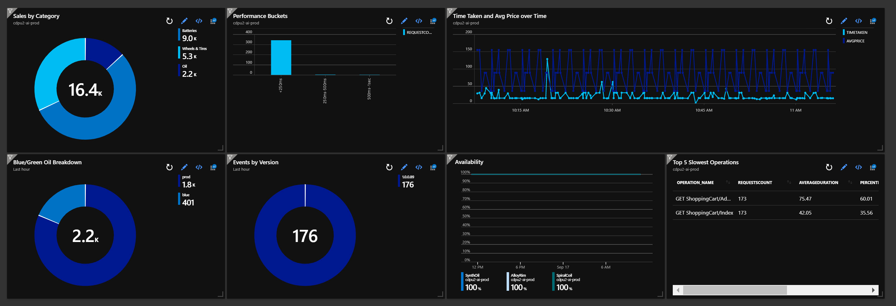

# Log Analytics Dashboard in Azure Portal

## Dashboard Layout


## Sales by Category
```
customEvents
| where timestamp > ago(1h)
| where name == "Cart/Server/Add" 
| project timestamp, Environment = tostring(customDimensions.Environment), Version = tostring(customDimensions.Version), Slot = tostring(customDimensions.SlotName), Category = tostring(customDimensions.ProductCategory), Product = tostring(customDimensions.Product), Price = todouble(customMeasurements.Price)
| summarize sum(Price) by Category
| render piechart   
```

## Blue-Green Oil Breakdown
```
customEvents
| where timestamp > ago(1h)
| where name == "Cart/Server/Add" 
| project timestamp, Environment = tostring(customDimensions.Environment), Version = tostring(customDimensions.Version), Slot = tostring(customDimensions.SlotName), Category = tostring(customDimensions.ProductCategory), Product = tostring(customDimensions.Product), Price = todouble(customMeasurements.Price)
| where Category == "Oil"
| summarize sum(Price) by Slot
| render piechart   
```

## Performance Buckets
```
// Performance bar-chart
requests
| where timestamp > ago(1h)
| summarize requestCount=sum(itemCount), avgDuration=avg(duration) by performanceBucket
| order by avgDuration asc  // sort by average request duration
| project-away avgDuration // no need to display avgDuration, we used it only for sorting results
| render barchart
```

## Events by Version
```
customEvents
| where timestamp > ago(1h)
| where name == "Cart/Server/Add" 
| project timestamp, Environment = tostring(customDimensions.Environment), Version = tostring(customDimensions.Version)
| where Environment == "prod"
| summarize count() by Version
| render piechart 
```

## Time Taken and Average Sales over time
```
customEvents
| where timestamp > ago(1h)
| where name == "Cart/Server/Add" 
| project timestamp, Environment = tostring(customDimensions.Environment), Version = tostring(customDimensions.Version), Slot = tostring(customDimensions.SlotName), Category = tostring(customDimensions.ProductCategory), Product = tostring(customDimensions.Product), Price = todouble(customMeasurements.Price), ElapsedTime= todouble(customMeasurements.ElapsedMilliseconds) 
| summarize TimeTaken = avg(ElapsedTime), AvgPrice = avg(Price) by bin(timestamp, 2s)
| render timechart
```

## Top 5 Slowest
```
// Calculate request count and duration by operation
requests
| where timestamp > ago(1h)
| summarize RequestsCount=sum(itemCount), AverageDuration=avg(duration), percentiles(duration, 50, 95, 99) by operation_Name // you can replace 'operation_Name' with another value to segment by a different property
| order by AverageDuration desc // order from highest to lower (descending)
| take 5
```

